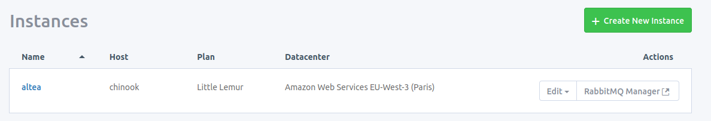
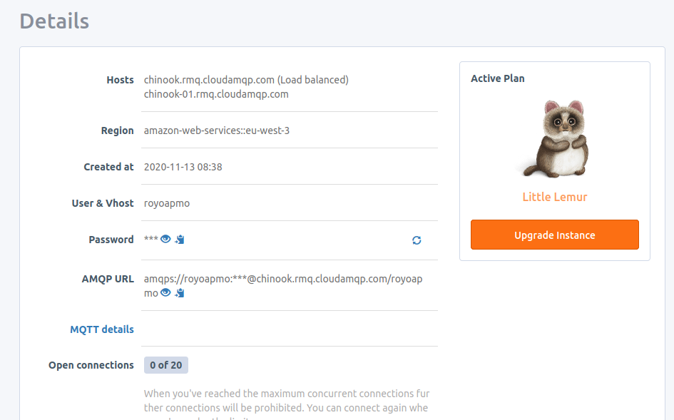
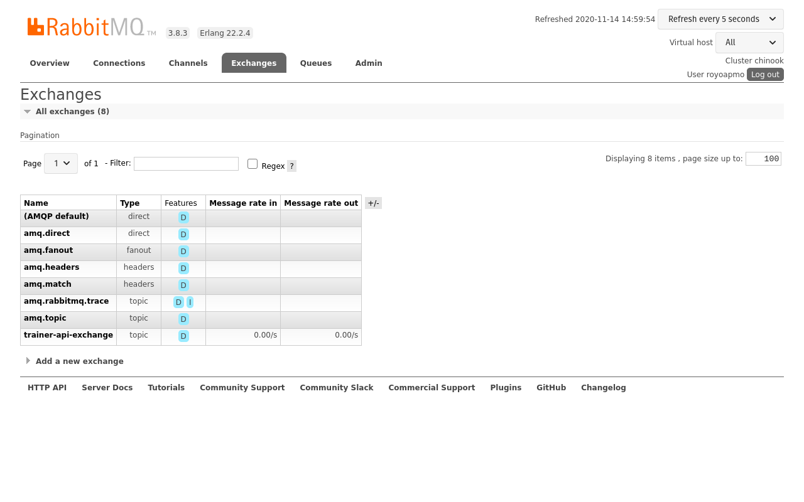
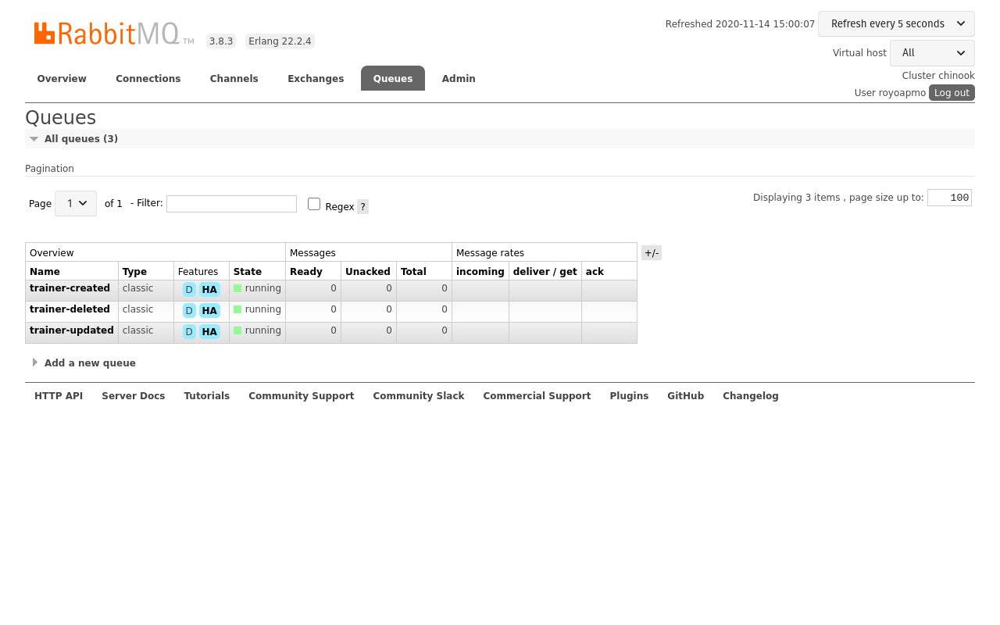
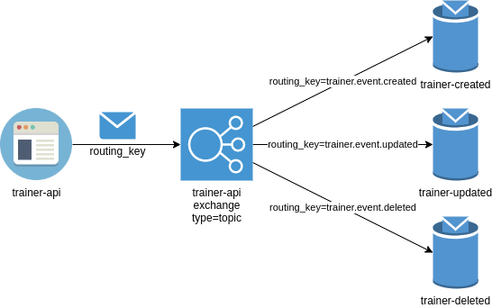
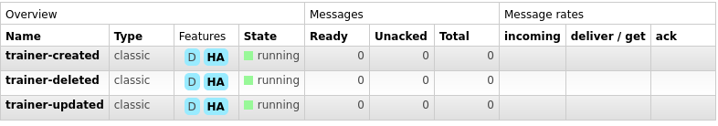
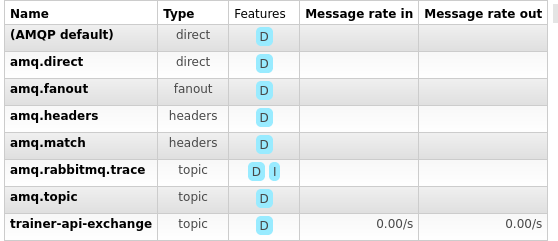
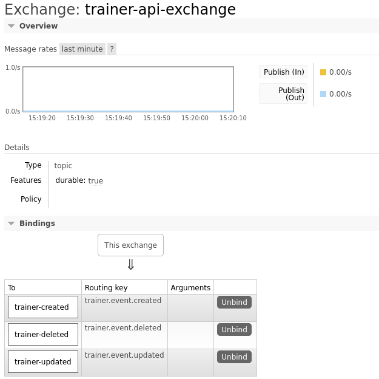
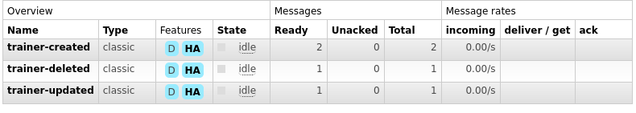
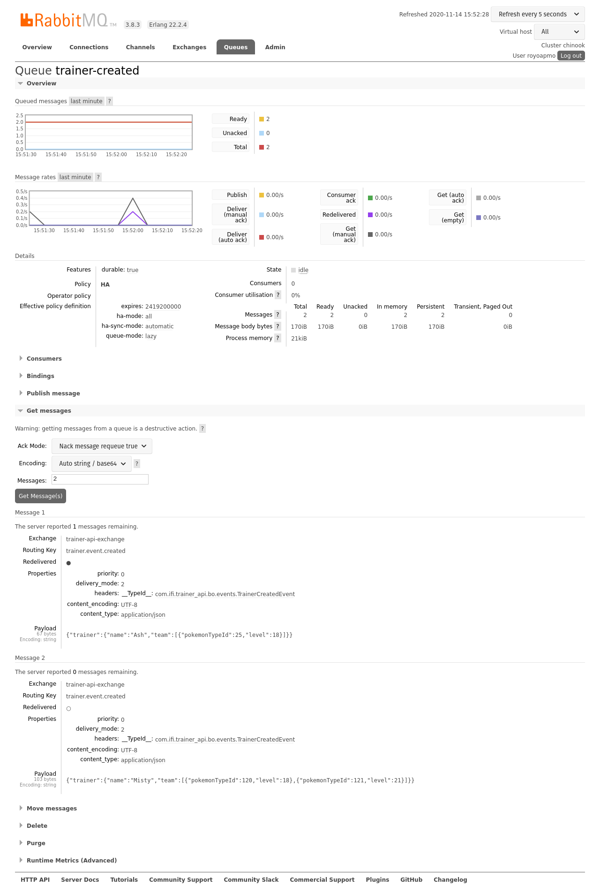

:source-highlighter: pygments
:prewrap!:

:icons: font

:toc: left
:toclevels: 4

:linkattrs:

:sectlinks:
:sectanchors:
:sectnums:

:experimental:

:stem:

= ALOM - TP 11 - Messaging

== Présentation et objectifs

Le but de ce TP est de mettre en place quelques mécaniques pour les développements d'échanges de messages avec RabbitMQ.

Nous allons :

* envoyer des messages à un broker rabbit Mq
* s'abonner à un broker rabbit Mq pour recevoir des messages
* interconnecter toutes nos API trainers-api entre-elles

== Envoi de messages à un broker

Nous allons tout d'abord configurer `trainer-api` pour être capable d'envoyer des messages lors de la création d'un `Trainer`.

=== Création d'un broker en ligne

Pour commencer, il nous faut un broker RabbitMQ.

Le site web https://www.cloudamqp.com/ fournit des brokers gratuits avec certaines limitations.
Vous pouvez :

* vous créer un compte ou vous connecter avec Github / Google
* créer une instance de broker en sélectionnant le plan "Little Lemur (Free)"
* sélectionner une région (j'ai choisi AWS Paris)

Une fois le broker créé, vous pouvez récupérer vos informations de connection en cliquant dessus

Le bouton `RabbitMQ Manager` permet d'accéder à un outil de gestion pour voir/créer/supprimer des _Queues_, _Exchanges_ et _Bindings_.

=== trainer-api

==== Dépendance maven

Ajoutez la dépendance maven suivante dans votre projet :

[source,xml]
.pom.xml
----
<dependency>
    <groupId>org.springframework.boot</groupId>
    <artifactId>spring-boot-starter-amqp</artifactId>
</dependency>
----

==== Configuration de la connexion à RabbitMq

Avec les informations que vous récupérez, ajouter des properties dans votre `application.properties` (ou bien dans votre serveur de configuration !).

[source,properties]
.application.properties
----
# <1>
spring.rabbitmq.host=
spring.rabbitmq.virtual-host=
spring.rabbitmq.username=
spring.rabbitmq.password=
----
<1> Ajoutez les properties, ainsi que les valeurs que vous récupérez pour votre broker !

Ajoutez également une properties trainer.api.exchange.name

==== Event

Pour envoyer des événements, on va donc pouvoir créer une classe dédiée.

Créez une classe `TrainerEvent` qui contient un type ( "created", "updated", "deleted" ), et le `Trainer` associé.
Vous pouvez également créer 3 sous-classes, `TrainerCreatedEvent`, `TrainerUpdatedEvent` et `TrainerDeletedEvent` si vous le souhaitez.

NOTE: Le type nous servira de _routing_key_, pour alimenter 3 _Queue_ différentes à partir du même _Exchange_

==== Création de l'exchange / queues / bindings

Nous allons maintenant créer un exchange "trainer-api-exchange", qui sera utilisé par l'API Trainers pour envoyer les événements sur les Trainers.
Nous allons ensuite créer 3 _Queues_ `trainer-created`, `trainer-updated` et `trainer-deleted`.
Nous allons ensuite binder les _Queues_ avec l'_Exchange_.

Il existe 2 moyens pour créer des _Exchanges_, _Queues_, et _Bindings_:

* Utiliser le `AmqpAdmin` dans une méthode de configuration
* Déclarer des `@Bean`  de type `Queue`, `Exchange` ou `Binding` dans une classe de configuration.

Pour créer des `Queue`, `Exchange` ou `Binding`, Spring propose des classes `QueueBuilder`, `ExchangeBuilder` et `BindingBuilder`.
Voici un exemple d'utilisation de ces classes pour déclarer ces objets :

[source,java]
----
@Bean
Queue trainerCreatedQueue(){
    return QueueBuilder.durable("trainer-created").build();
}

@Bean
Exchange trainerApiExchange(){
    return ExchangeBuilder.topicExchange("trainer-api").build();
}

@Bean
Binding trainerApiExchangeToTrainerCreatedQueueBinding(){
    return BindingBuilder.bind(trainerCreatedQueue()).to(trainerApiExchange()).with("trainer.event.created").noargs();
}
----

Le but est d'obtenir l'architecture suivante :

Vous devriez également constater dans le RabbitMQ Manager que vos objets sont bien créés

==== Envoi des événements

L'envoi des objets dans les exchanges se fait à l'aide d'un `AmqpTemplate` Spring, qu'on peut recevoir en injection de dépendance.
Par défaut, les messages envoyés à RabbitMQ sont de simples `byte[]`:

[source,java]
----
MessageProperties messageproperties = MessagePropertiesBuilder.newInstance().build(); //<1>
Message message = MessageBuilder.withBody("12.34".getBytes()).andProperties(messageproperties).build(); //<2>
amqpTemplate.send( //<3>
        "marketData.exchange", //<4>
        "quotes.nasdaq.THING1", //<5>
        message); //<6>
----
<1> On doit créer un MessageProperties (les headers du message)
<2> On crée le Message en lui-même, avec son contenu en `byte[]`, et son MessageProperties
<3> On appelle la méthode `send` d'un AmqpTemplate
<4> Le premier paramètre est le nom de l'Exchange dans lequel on doit envoyer le Message
<5> Le paramètre suivant est le `routing_key`
<6> Enfin, on passe le message en paramètre

Envoyer les messages sous la forme d'un `byte[]` n'est pas très pratique. Heureusement, Spring peut nous aider en faisant de la conversion automatique d'objets Java en Messages.

Un `MessageConverter` a pour objectif de transformer un object Java, en Message AMQP. Si un `MessageConverter` est présent dans l'application context, Spring l'utilisera.
Nous allons instancier un `MessageConverter` qui utilise `Jackson`, pour transformer nos objets en JSON, et insérer ce JSON dans nos Messages AMQP:

[source,java]
.AmqpConfig.java
----
@Bean
MessageConverter messageConverter(){
    return new Jackson2JsonMessageConverter();
}
----

Dans votre `TrainerServiceImpl`, vous devez :

* recevoir un `AmqpTemplate` en injection de dépendance
* l'appeler dans vos méthodes `createTrainer`, `deleteTrainer` et `updateTrainer`
* envoyer vos objets d'événements `TrainerEvent` à l'aide de la méthode `convertAndSend` du `AmqpTemplate`

Voici un exemple :

[source,java]
----
amqpTemplate.convertAndSend("trainer-api-exchange", "trainer.event.created", new TrainerCreatedEvent(trainer));
----

Créez quelques `Trainers` en utilisant votre API, et constatez que les événements sont présents dans les `Queues` :

== Consommation des messages

Nous allons créer un nouveau micro-service (!) dédié à la réception des événements émis par les autres.

Initialisez un nouveau projet Github en cliquant sur ce lien : https://classroom.github.com/a/F86ql4rs

=== notification-api

==== Dépendances Maven

Ajoutez les dépendances `spring-boot-starter-amqp` et `spring-boot-starter-json` à vorre projet.

==== Configuration

Créez une classe de configuration Spring `AmqpConfig` qui contiendra la déclaration d'un `@Bean` `MessageConverter` Jackson.

Ajoutez également un `application.properties` à votre projet, pour y configurer la connexion à RabbitMQ, ou paramétrez votre projet pour
se connecter à votre `configuration-api`.

==== Réception des événements

Pour recevoir des objets depuis une _Queue_, il suffit :

* d'ajouter l'annotation `@EnableRabbit` sur une classe de configuration
* d'écrire une méthode qui va recevoir en paramètre l'objet Java voulu
* d'annoter cette méthode avec `@RabbitListener`

Voici un exemple d'implémentation :

[source,java]
.TrainerEventsListener.java
----
private static final Logger log = LoggerFactory.getLogger(NotificationListener.class);

@RabbitListener(queues = "trainer-created")
void receiveCreateEvent(TrainerCreatedEvent trainerCreatedEvent){
    log.info("Received event : trainer created : {}", trainerCreatedEvent.getTrainer().getName());
}
----

et les logs associés :

----
2020-11-14 16:12:55.452  INFO 98921 --- [ntContainer#1-1] c.m.notification.TrainerEventsListener    : Received event : trainer deleted : Misty
2020-11-14 16:12:55.452  INFO 98921 --- [ntContainer#0-1] c.m.notification.TrainerEventsListener    : Received event : trainer updated : Misty
2020-11-14 16:12:55.452  INFO 98921 --- [ntContainer#2-1] c.m.notification.TrainerEventsListener    : Received event : trainer created : Ash
2020-11-14 16:12:55.457  INFO 98921 --- [ntContainer#2-1] c.m.notification.TrainerEventsListener    : Received event : trainer created : Misty
----

Ici, on affiche simplement un log avec les informations reçues, mais on pourrait imaginer envoyer un mail,
envoyer une notification IOS ou Android

== Pour aller plus loin

* Recevez les événements `TrainerCreated`, `TrainerUpdated`, et `TrainerDeleted` dans notification-api
* Dans `battle-api`, envoyez des événements au début d'un combat ("Un combat entre Ash et Misty commence!"),
et à la fin d'un combat ("Ash a gagné le combat!").
** Recevez ces événements dans notification-api également

