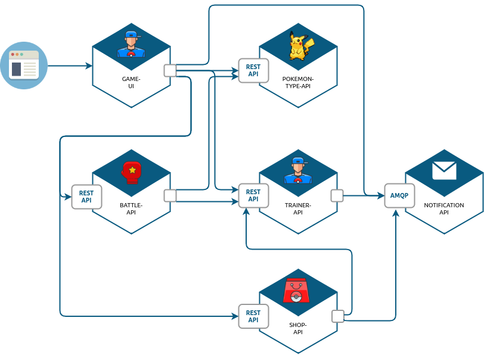
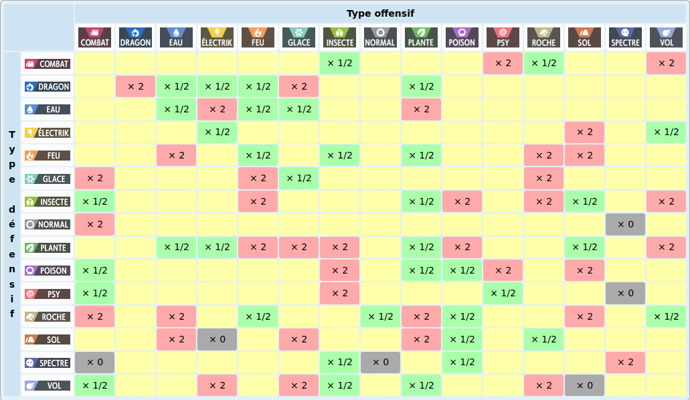

:source-highlighter: pygments
:prewrap!:

:icons: font

:iconfont-cdn: https://use.fontawesome.com/releases/v5.4.2/css/all.css

:toc: left
:toclevels: 4

:linkattrs:

:sectlinks:
:sectanchors:
:sectnums:

:experimental:

:stem:

= ALOM - TP 10 - Rendu !

== Présentation et objectifs

Le but est de finaliser le développement de notre architecture "à la microservice".

.Notre architecture !

TIP: Pendant ce TP, nous terminons les TP précédents !

Pour pratiquer encore, je vous propose également d'ajouter le gain d'XP, les multiplicateurs de type, et une boutique à notre jeu !

== Gain d'XP

Avec l'arrivée des combats, on constate que les statistiques de nos cher Pokemon sont importantes.
Les combats successifs mettent les Pokemon et leurs dresseurs à rude épreuve.

Ajoutez la statistique "experience" aux Pokemons, dans l'API Trainer.
La statistique "level" devient une propriété calculée.

Le niveau du Pokemon "level" est la racine cubique du nombre de points d'expérience (arrondi à l'inférieur).
À l'inverse, un pokemon d'un certain niveau possède en points d'expérience la valeur du niveau au cube.

Par exemple, Ondine (Misty), possède un Stari et un Staross, de niveaux 18 et 21.
Stari a donc 18³ points d'expérience, soit 5832.
Staross a 21³ points d'xp, soit 9261.

Avec 6245 points d'expérience, Pikachu est au niveau 18 également. Pour passer au niveau 19, il lui faudra 19³-6245 points d'XP supplémentaire.

Les niveaux des Pokemons sont limités à 100 pour un nombre d'XP maximum de 1 000 000.

Le gain d'expérience lors d'un combat est régi par la formule suivante :

`1.5*(baseExperience)*(level pokemon vaincu)`

Quand Pikachu met KO le Stari d'Ondine, il gagne `1.5 * 112 * 18 = 3024` points d'expérience

L'expérience des Pokemon grandi à chaque combat, et leur niveau avec.

Dans l'API Battle, lorsqu'un Pokemon en met KO un autre, modifiez l'expérience du Pokemon qui a gagné avec ces formules,
et sauvegardez la nouvelle information dans l'API Trainer (via un PUT HTTP, ou un message AMQP)

== Multiplicateurs de type

NOTE: Cette partie n'est pas notée, c'est pour vous occuper si vous le souhaitez :)

Lorsqu'un Pokemon en attaque un autre, les dégats infligés dépendent également du type de pokemon attaquant / défenseur.

Voici le tableau de multiplicateur de dégats en fonction des types attaquants / défenseurs:

Appliquez les modificateurs de type dans votre `battle-api` !

== La boutique

Les dresseurs de Pokemon ont un portefeuille virtuel composé de Poké-Dollar 💰.

Ils peuvent créditer leur portefeuille en achetant des Poké-Dollar, au taux de change d'1 euro pour 20 000 💰.
Chaque dresseur démarre avec la somme de 10 000 💰 offerts.
Un dresseur qui se crée un compte, peut aussi également choisir un Pokemon offert parmi les 3 starters (id 1, 4, 7).

Une boutique leur permet :

* d'acheter des Pokeballs contenant des Pokemons aléatoires !
* d'acheter des bonbons pour augmenter le niveau d'un Pokemon !

Voici quelques objets disponibles dans la boutique:

|===
| Super Bonbon | Augmente le niveau d'un Pokemon ! | 5 000 💰
| Pokeball | Contient un Pokemon aléatoire commun de niveau 5 | 10 000 💰
| SuperBall | Contient un Pokemon aléatoire non-commun de niveau 10 | 25 000 💰
| HyperBall | Contient un Pokemon aléatoire rare de niveau 20 | 50 000 💰
| MasterBall | Contient un Pokemon aléatoire légendaire (un seul achat max par dresseur) de niveau 40 | 100 000 💰
|===

L'achat d'une PokeBall, SuperBall, HyperBall ou MasterBall a pour effet d'ajouter le Pokemon à la liste des Pokemon du dresseur.

.Ids de rareté des Pokémons (probabilités égales pour chaque id)
|===
| Pokemons communs | 10 13 16 19 41 133 48 43 129 96 52 21 69 46 98 116
| Pokemons non-communs | 35 32 29 23 104 118 60 90 39 81 92 102 79 54 124 120 72 132
| Pokemons rares | 147 58 74 95 77 37 109 27 126 63 25 125 66 88 111 100 108 123 127 114 138 140
| Pokemons légendaires | 144 145 146 150 151
|===

Le lien pour créer le squelette de votre projet sur Github est le suivant : https://classroom.github.com/a/xDwKnkab

La boutique doit :

* gérer le portefeuille de chaque dresseur, et lui permettre de l'approvisionner via une API REST
* exposer une API REST consommable par le `game-ui` pour afficher la liste des produits
* mettre à jour l'équipe du dresseur lors d'un achat (avec un PUT REST ou un message AMQP)

== Modalités de la séance

Pendant cette séance, j'attends de chacun de vous :

* un présentation rapide de votre avancement sur les TP
* parcourir un peu les codes compliqués (battle-api)
* les points de difficulté rencontrés

== Modalités de rendu

Le rendu se fait via vos repositories Github.

Vous devez push votre code directement sur les repositories qui vous sont affectés.

Les repositories seront clôturés le 23 décembre à 20h. Vous avez donc encore un peu de temps pour finaliser votre projet.

Le projet est bien constitué de 7 parties jusqu'à aujourd'hui, plus une partie supplémentaire dont le sujet est détaillé plus haut :

* pokemon-type-api
* trainer-api
* game-ui
* battle-api
* configuration-api
* configuration-repository
* notification-api
* shop-api

NOTE: Le tp "handcraft" ne fait pas partie du rendu.

Dans chacun des repository :

* le code !
* les tests !!
* une collection Postman pour les API exposant de l'HTTP (pas l'api notification, ni configuration)
* un README.md détaillant
** la façon de lancer le projet localement (commandes maven ? properties à configurer ?)
** l'url de publication de votre service s'il est publié sur un cloud heroku/clever

NOTE: Evitez de commiter/pusher vos répertoires `target` et vos fichiers eclipse/intelliJ `.idea`, `.settings`...
Vous pouvez ajouter un fichier `.gitignore` à la racine de vos projets pour cela.

== Critères de notation

|===
| API | Fonctionnalité | Points

| pokemon-type-api
| types de pokemon traduits, triés, traduits (en+fr), filtre par type
| 1

| trainer-api
| gestion des trainers (GET/POST) avec stockage BDD
| 1

| trainer-api
| API sécurisée en Basic HTTP login + mot de passe1
| 1

| game-ui
| affichage du pokedex traduit, filtrage par type
| 2

| game-ui
| IHM sécurisée (login avec les comptes de trainers)
| 2

| game-ui
| affichage des trainers et de leurs pokémons
| 2

| configuration-api / configuration-repository
| configuration des api, gestion de profils
| 1

// socle commun : 10 points

| battle-api
| gestion des combats (création/attaque)
| 3

| game-ui
| intégration de l'écran de jeu
| 1

| shop-api
| achat d'objets et impacts sur le trainer
| 3

| battle-api / trainer-api
| gestion de l'expérience
| 2

| toutes API
| qualité globale de code
| 1

// devs supplémentaires : 8 points

|===

== Amélioration continue

Aidez moi à m'améliorer !

Pour ce faire, remplissez ce https://forms.gle/9sMf7fk6jtbecPfb8[sondage]
(c'est anonyme! ça vous prendra moins de 10 minutes, il y a 8 questions + commentaires libres)
